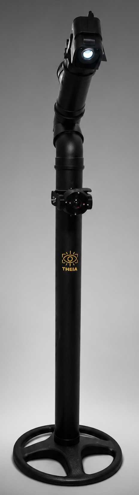
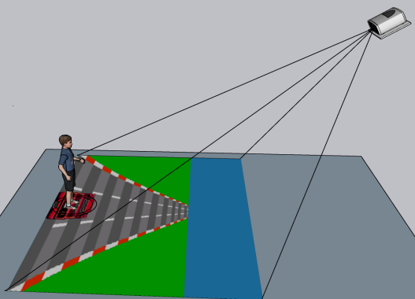

<h1>T-TEA</h1>

<div>
  

  <h3>Console para Exergames de Chão Interativo</h3>

  <p align="justify">
    Software para um console de Chão Interativo desenvolvido inicialmente com foco no público com Transtorno do Espectro Autista (TEA), mas que também permite a criação de jogos sérios destinados a outros públicos. O projeto foi desenvolvido pelo doutorando André Bonetto Trindade e Gabriel Brunelli Pereira, sob orientação do Prof. Marcelo da Silva Hounsell (UDESC). O projeto Torre para crianças com Transtorno do Espectro Autista (T-TEA) tem como objetivo auxiliar na terapia do processamento sensorial por meio de uma plataforma interativa, móvel e de baixo custo
  </p>

  <p align="justify">
    O hardware é composto por projetor de vídeo, câmera webcam e computador
    convencionais. A webcam é um dispositivo relativamente barato e pode ser
    encontrado com facilidade, o que pode ser visto como fator positivo para
    adoção do jogo em instituições públicas.
  </p>

  <p align="justify">
    Sendo que o projetor e o computador são convencionais, pode-se utilizar os
    que já se têm disponíveis nas instituições. Desta forma, reutilizando
    equipamentos, o custo final da plataforma T-TEA é significativamente
    reduzido.
  </p>

  <p align="justify">
    Estes equipamentos são instalados em uma estrutura física de montagem
    simples e de fácil portabilidade.
  </p>
</div>

<br clear="all">

<h2>Jogos</h2>

<p align="justify">
  O T-TEA possui diferentes jogos sérios desenvolvidos com objetivos
  terapêuticos e de estímulo de diferentes habilidades.
</p>

<div>
  

  <h3>Kartea</h3>

  <p align="justify">
    Seu objetivo é auxiliar no desenvolvimento da integração multissensorial,
    através da estimulação da concentração, atenção, coordenação motora e
    lateralidade do jogador. Sua mecânica ambienta o jogador em uma estrada
    com 3 pistas, e coloca-o no controle de um carro através da movimentação
    lateral de seu corpo.
  </p>

  <p align="justify">
    O jogador deve se movimentar apenas lateralmente pela tela, e capturar
    alvos (estrelas) e desviar de obstáculos (barreiras) para pontuar e passar
    de nível.
  </p>

</div>

<br clear="all">

## Desenvolvimento

### Requisitos

- Python >= 3.10
- [uv](https://docs.astral.sh/uv/) >= 0.11.32
- Computador com arquitetura x86-64 ou ARM.

### Instalar o uv

O uv baixa e gerencia automaticamente a versão correta do Python e as dependências do projeto.

macOS:

```bash
brew install uv
```

Windows (PowerShell):

```powershell
winget install --id=astral-sh.uv -e
```

Linux:

```bash
curl -LsSf https://astral.sh/uv/install.sh | sh
```

### Executar

Na raiz do projeto, em qualquer sistema:

```bash
uv run dev
```

Esse comando baixa a versão correta do Python, cria o `.venv`, sincroniza as dependências e inicia o T-TEA.

### Importante

No primeiro uso, permita o acesso à câmera nas configurações de privacidade do sistema.

<br clear="all">

<h1 align="center">Realização</h1>
<p align="center">
  <a href="https://github.com/larvattea"></a><a href="https://github.com/larvattea"></a><a href="https://github.com/larvattea"></a>
</p>

